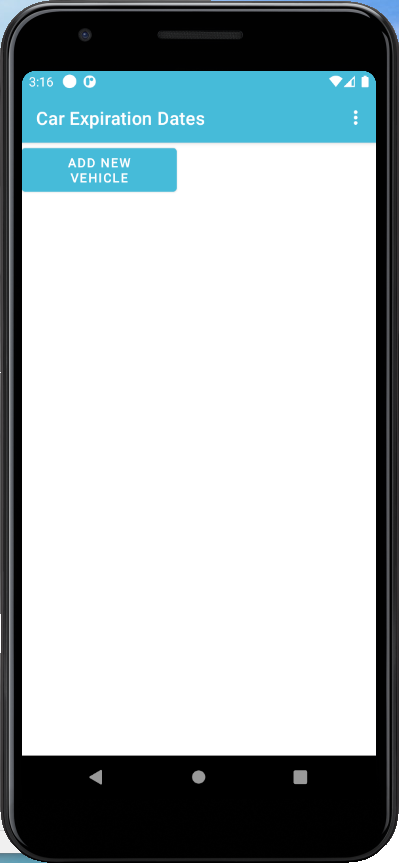
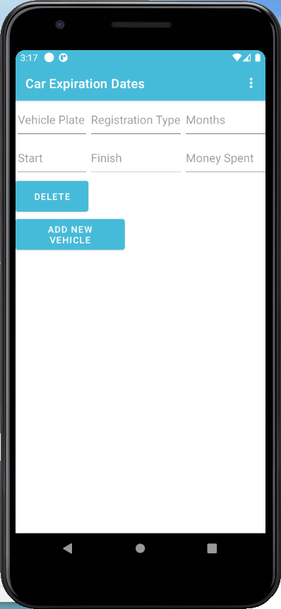
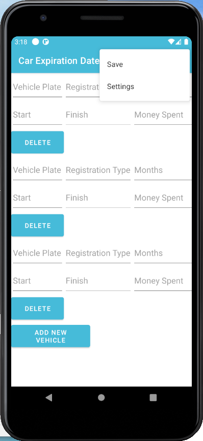
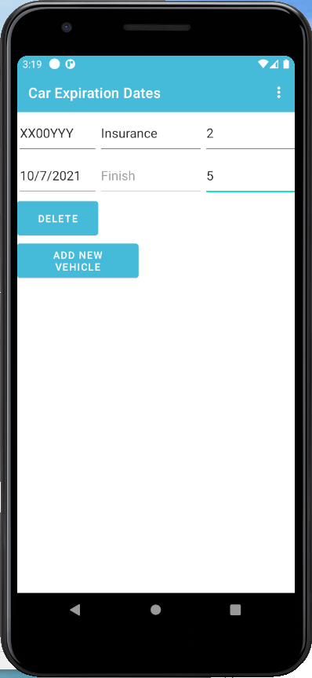
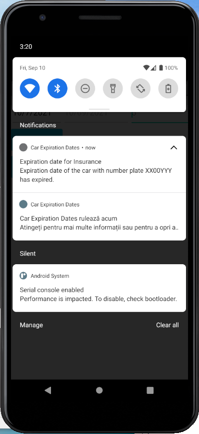

# Car Expiration Dates App
 An app that tracks the expiration date of different documents of your car

I used Java to make the app.

Languages:
<pre>
-English
-Romanian
</pre>

Features:
<pre>
-Notifications
-Autoload from a database
-Service running 24/7 to check if a date is about to expire
</pre>

Others:
<pre>
-Almost inexistent resource consumption
-Time complexity is O(n)
</pre>

Main Activity the first time you open the app

After pressing "Add New Car" button

Menu

Example before pressing save

Example after pressing save

Notification of an insurance that expired/is about to expire and the service that is running 24/7

